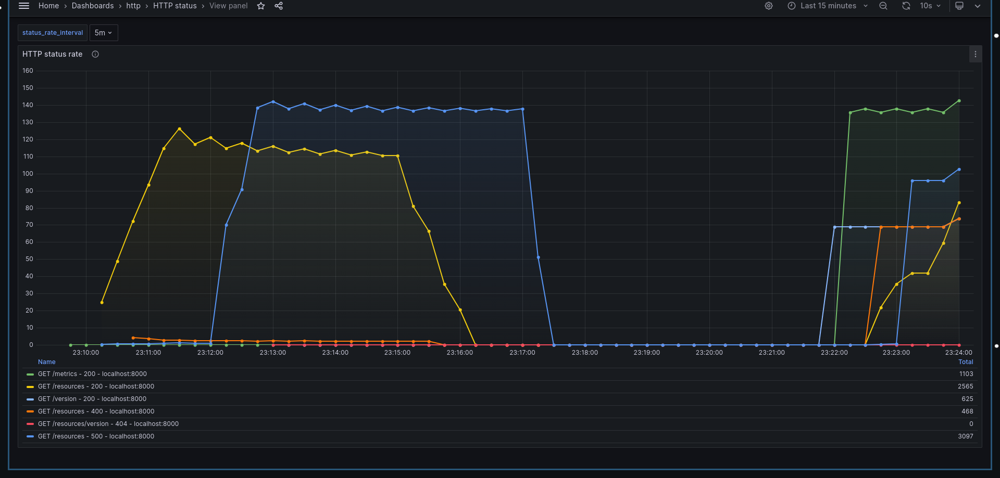
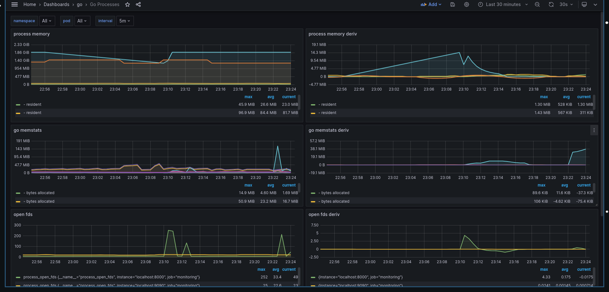
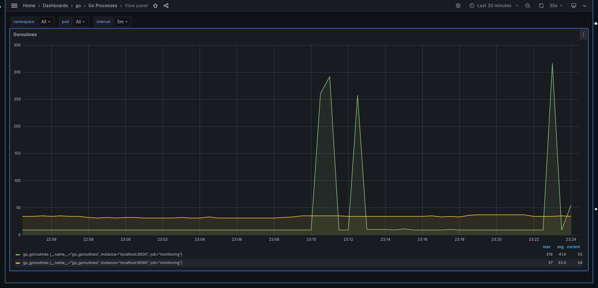

## Golang webservice template

This is a template for a go application that:

1.  Exposes an HTTP API using openapi and echo as a router. API types are auto generated from the openapi definition.

2.  Exposes metrics through prometheus. A grafana dashboard is also there.

### Run

Db+prometheus+grafana:

```bash
docker compose --profile monitoring up
```

Seed the db:

```bash
./pkg/storage/seeder.sh # expects psql to be installed
```

Go app:

```bash
make run
```

### Testing

This tool can be used to load test the application and observe something
meaningful in grafana. https://github.com/codesenberg/bombardier
After installing it, run:

```bash
bombardier  -c 20 -n 20000 'http://localhost:8000/resources?tags=docker'
```




